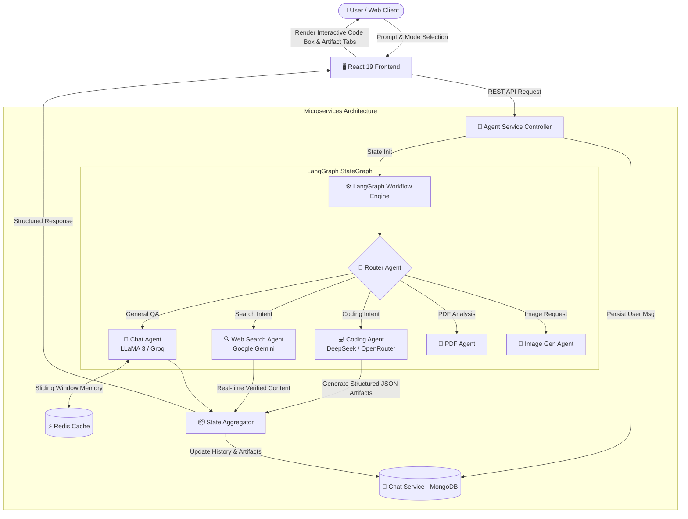

# 🤖 FreeAI — Intelligent Multi-Agent Orchestration Platform

<div align="center">


**An enterprise-grade, distributed AI platform that autonomously classifies, routes, and executes complex tasks across specialized AI agents (Coding, Web Search, Document Analysis, and Conversational QA).**

[Features](#-key-features) • [Architecture](#-architecture--workflow) • [Tech Stack](#-technology-stack) • [Quick Start](#-quick-start) • [Showcase & Pitch](#-project-showcase--portfolio-assets)

</div>

---

## 🌟 Executive Summary

**FreeAI** is a scalable, multi-agent AI workspace designed to solve the limitations of single-model chatbots. By combining **LangGraph state graphs**, **Microservices architecture**, and **specialized LLMs** (DeepSeek, Google Gemini, LLaMA 3 via Groq), FreeAI autonomously analyzes user intent and delegates tasks to the optimal AI specialist.

Whether generating multi-file code artifacts with structured execution steps or conducting real-time factual web searches, FreeAI delivers fast, structured, and production-ready responses through an intuitive, ChatGPT/Claude-inspired interface.

---

## 🚀 Key Features

### 1. 🧠 Intelligent Multi-Agent Supervisor & Router
- **Autonomous Intent Classification**: Classifies queries across `coding`, `search`, `imageGen`, `pdf`, and `chat`.
- **LangGraph StateGraph Workflow**: State-managed orchestration ensuring deterministic execution, memory isolation, and seamless agent handoffs.
- **Manual & Automatic Routing**: Switch seamlessly between `Auto-Route`, `Web Search (Gemini)`, and `Coding Agent (DeepSeek)`.

### 2. 💻 DeepSeek Coding Agent & Interactive Code Artifacts
- **Structured JSON Artifact Engine**: Code generation produces complete project structures including titles, descriptions, multi-file code trees, dependency lists, and run/test instructions.
- **ChatGPT-Style Interactive Code Box**:
  - Top header with file names, language badges, and one-click copy with animated feedback.
  - Multi-file tabbed viewer to navigate complex code structures effortlessly.
  - Dark-mode syntax styling and clean scrolling.

### 3. 🔍 Real-Time Web Research Agent (Google Gemini)
- **Live Web Grounding**: Retrieves real-time data, factual news, live documentation, and API updates.
- **Grounded Responses**: Synthesizes verified information without hallucinated citations.

### 4. ⚡ Microservices Architecture & Memory Management
- **Auth Service**: Secure user authentication and session management.
- **Chat & History Service**: Persistent chat histories with MongoDB schemas supporting structured artifacts.
- **Agent Orchestrator Service**: LangGraph execution pipeline with Redis sliding-window conversational memory.

---

## 🏗 Architecture & Workflow



---

## 🛠 Technology Stack

| Layer | Technologies & Frameworks | Description |
|---|---|---|
| **Frontend** | React 19, Tailwind CSS v4, Lucide React, React Markdown, Remark GFM, Redux Toolkit | High-performance responsive UI with dynamic expanding textareas and tabbed code artifacts |
| **Agent Orchestration** | LangChain, LangGraph (`StateGraph`, `Annotation`), OpenRouter SDK | Dynamic state graph orchestration with intent classification and agent routing |
| **Backend Services** | Node.js, Express 5, Axios, Dotenv, CORS | Distributed microservices (Auth, Chat History, Agent Core) |
| **AI Models** | **DeepSeek V3 / R1** (Coding), **Gemini 1.5/2.0** (Search), **LLaMA 3-70B/8B** via Groq (Chat & Routing) | Best-in-class specialized models for cost and speed efficiency |
| **Data & Storage** | MongoDB (Mongoose), Redis | Persistent conversation storage with multi-file artifact schema and fast sliding memory |

---

## 📁 Repository Structure

```
multiagent/
├── ai1/
│   ├── frontend/                       # React 19 + Tailwind CSS Frontend
│   │   ├── src/
│   │   │   ├── components/
│   │   │   │   ├── CodeBlock.jsx       # ChatGPT-style code box & multi-file Artifact viewer
│   │   │   │   └── SideBar.jsx         # Collapsible chat history & navigation sidebar
│   │   │   ├── pages/
│   │   │   │   ├── home.jsx            # Main AI workspace, popover mode selector, chat feed
│   │   │   │   └── auth.jsx            # Authentication interface
│   │   │   └── feature/
│   │   │       └── Converations.js     # API client for agent & chat endpoints
│   │   └── package.json
│   │
│   └── backend/
│       └── services/
│           ├── agent/                  # LangGraph Multi-Agent Orchestrator
│           │   ├── agents/
│           │   │   ├── coding.agent.js # DeepSeek JSON code generation agent
│           │   │   ├── search.agent.js # Gemini real-time web search agent
│           │   │   ├── chat.agent.js   # Groq LLaMA general conversation agent
│           │   │   ├── pdf.agent.js    # PDF document extractor agent
│           │   │   └── imageGen.agent.js # Image generation agent
│           │   ├── config/
│           │   │   ├── model.js        # Dynamic LLM provider switcher
│           │   │   └── memory.js       # Redis sliding window memory
│           │   ├── graph/
│           │   │   ├── graph.js        # LangGraph StateGraph workflow definition
│           │   │   ├── routerAgent.js  # Intent classification & routing logic
│           │   │   └── state.js        # LangGraph state annotations
│           │   └── controllers/
│           │       └── agent.controllers.js # Agent HTTP endpoint & Chat service forwarder
│           │
│           ├── chat/                   # Conversation & Message History Service
│           │   ├── modles/
│           │   │   ├── message.model.js # Message schema supporting structured artifacts
│           │   │   └── conversation.model.js
│           │   └── controllers/
│           │       └── chat.controllers.js # CRUD for conversations and messages
│           │
│           └── auth/                   # User Authentication Service
│
└── README.md
```

---

## ⚡ Quick Start

### 1. Prerequisites
- **Node.js**: `v20+` or `v22+`
- **MongoDB**: Local or Atlas instance
- **Redis**: Local or cloud Redis instance
- **API Keys**: Groq, Google Gemini, OpenRouter (DeepSeek)

### 2. Environment Configuration

#### Agent Service (`ai1/backend/services/agent/.env`)
```env
PORT=3000
GROQ_API_KEY=your_groq_api_key
GROQ_MODEL=llama3-70b-8192
GEMINI_KEY=your_gemini_api_key
GEMINI_MODEL=gemini-1.5-flash
OPENROUTER_API_KEY=your_openrouter_api_key
OPENROUTER_MODEL=deepseek/deepseek-chat
CHAT_SERVICE=http://localhost:3001/chat
REDIS_URL=redis://localhost:6379
```

#### Chat Service (`ai1/backend/services/chat/.env`)
```env
PORT=3001
MONGO_URI=mongodb://localhost:27017/freeai_chat
```

### 3. Installation & Running

```bash
# 1. Install and start Agent Service
cd ai1/backend/services/agent
npm install
npm run dev

# 2. Install and start Chat Service (in a new terminal)
cd ai1/backend/services/chat
npm install
npm run dev

# 3. Install and start Frontend (in a new terminal)
cd ai1/frontend
npm install
npm run dev
```

Visit `http://localhost:5173` to open FreeAI.

---

## 💼 Project Showcase & Portfolio Assets

Use the following materials to showcase this project on GitHub, LinkedIn, portfolios, and interviews:

### 📌 1. Short Pitch (Elevator Pitch)
> *"FreeAI is a full-stack, distributed Multi-Agent AI platform built with LangGraph, Node.js microservices, and React 19. It solves model lock-in and single-model limitations by autonomously routing user queries across specialized LLMs (DeepSeek for code generation, Gemini for live web search, and LLaMA 3 for ultra-low latency chat). It features a Claude/ChatGPT-style artifact system that compiles complex coding prompts into structured, multi-file codebases with one-click copy and execution instructions."*

### 📝 2. Resume / Portfolio Bullet Points
- **Designed and implemented a distributed Multi-Agent AI architecture** using LangGraph (`StateGraph`), routing queries across specialized LLMs (DeepSeek, Gemini, LLaMA 3) based on real-time intent analysis.
- **Built an interactive Code Artifacts engine** in React 19 & Tailwind CSS, enabling multi-file tab navigation, syntax highlighting, copy-to-clipboard, dependency parsing, and step-by-step test instructions.
- **Engineered resilient backend microservices** with Express 5, MongoDB, and Redis sliding-window memory to maintain persistent chat context across multi-turn agent conversations.
- **Implemented zero-downtime model routing and schema validation** using JSON Schema and Mongoose to ensure 100% parseable structured outputs from LLM responses.

### 🌐 3. LinkedIn Post Template
```markdown
🚀 Excited to unveil FreeAI — an autonomous Multi-Agent AI Orchestration Platform!

Single-model AI assistants often struggle when switching between heavy coding, real-time factual research, and rapid conversation. FreeAI solves this with a distributed Multi-Agent StateGraph architecture:

✨ Key Highlights:
🧠 Autonomous Supervisor (LangGraph): Intelligently classifies intent and routes queries to the best LLM specialist.
💻 DeepSeek Coding Agent: Generates structured, multi-file code artifacts with interactive tabs and run guides.
🔍 Google Gemini Web Search: Live factual verification with real-time web grounding.
⚡ Ultra-fast LLaMA 3: Low-latency conversational intelligence via Groq.
🎨 Modern React 19 UI: Fluid auto-expanding prompt input, ChatGPT-style code blocks, and persistent MongoDB chat history.

Tech Stack: LangGraph • React 19 • Tailwind CSS • Node.js • Express • MongoDB • Redis • DeepSeek • Gemini • Groq

Check out the repository here: [YOUR_GITHUB_LINK]

#AI #MultiAgent #LangChain #React #NodeJS #DeepSeek #WebDevelopment #SoftwareEngineering #OpenSource
```

---

<div align="center">
Built with passion for Autonomous Multi-Agent AI.
</div>

